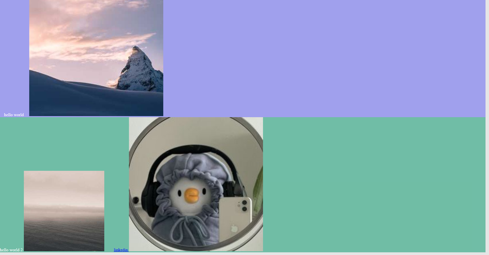

# C-HTML

> C-program to build beauty HTML templates

## Usage

```shell
./chtml (> {output}.html)?
```

open the generated file with your favorite browser and see the beautiful page you created.



## Memory check

Running valgrind to check for memory leaks

```shell
make mem_check
```

## Installation

```shell
sudo apt install gcc make automake valgrind
```

